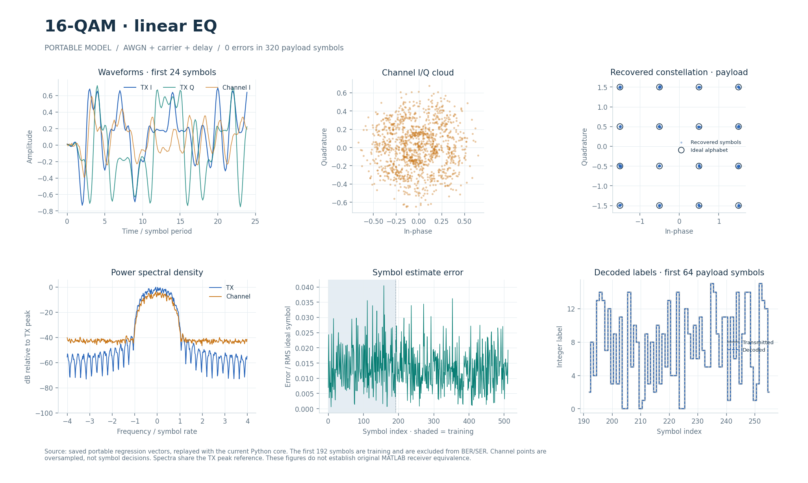
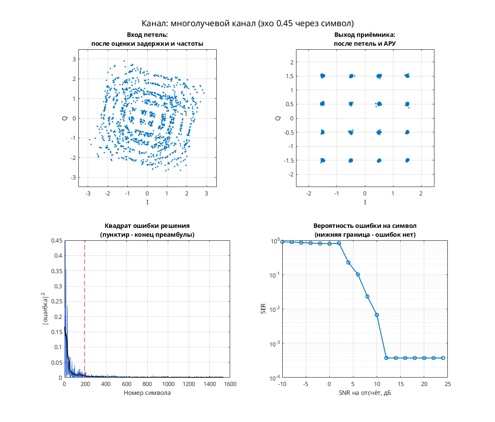
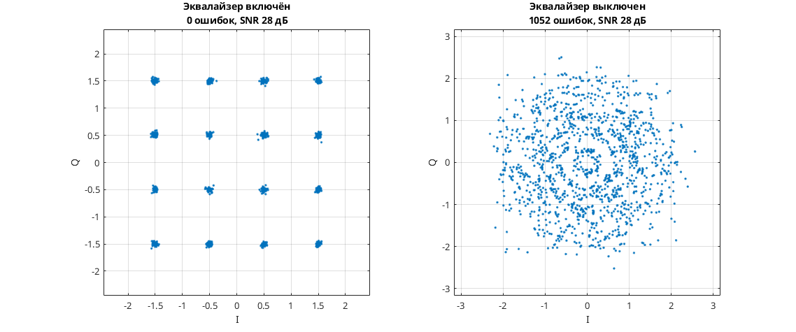

# 16-QAM-модем с переменной задержкой и эквалайзером NLMS (2007-07-21)

Кадровая модель 16-QAM с формированием импульса, синхронизацией по преамбуле и сопровождением параметров канала.

## Что это

Исторический прототип — Simulink-модель `qam_fb_symbol_sync_fb_phase_sync_agc_var_ch_delay_eq_2007_07_21.mdl`. Переносимые реализации есть на Python, Octave/MATLAB и поведенческом SystemVerilog с UVM. Отдельно существует потоковый fixed-point RTL. Общие Python-тесты проверяют кодер, передачу без шума, канал с шумом/задержкой/несущей, повторяемость, неверный ввод и отрицательный контроль при −8 дБ; специальные проверки зависят от конфигурации. Сохранённые результаты межъязыковых прогонов описаны в [VERIFICATION.md](../../docs/VERIFICATION.md). Совпадение переносимых реализаций не устанавливает полную эквивалентность историческому приёмнику.

Историческая модель в публичный репозиторий не входит. В [source_parameters.json](source_parameters.json) сохранены извлечённые поля блоков и номера строк `source_line`; происхождение и SHA-256 исходного файла записаны в полях `source` и `source_sha256` файла [config.json](config.json). Размер исходника — 155685 байт по [архивному манифесту](../../docs/archive_inventory.json), который также содержит его SHA-256. В `source_parameters.json` записаны параметры блоков, а не полный манифест файла; `model.json` в этом модуле отсутствует.

## Как работает

1. TX получает целочисленные метки, выполняет заданное конфигурацией кодирование и выбирает комплексные точки из таблицы `constellation`.
2. После вставки нулей импульсы проходят через RRC-фильтр единичной энергии: 33 коэффициента, порядок 32, `rolloff=1`. Возвращается сигнал вместе с хвостом FIR.
3. `channel` моделирует AWGN, усиление, поворот фазы, частотное смещение и дробную задержку; для специальных проверок доступны эхо и дрейф тактов.
4. RX применяет согласованный RRC и ищет задержку от 0 до 16 отсчётов с шагом 0.25. Четырёхточечная кубическая интерполяция Лагранжа задаёт дробные моменты выборки. Наклон развёрнутой фазы на преамбуле оценивает частоту, комплексная корреляция — фазу и усиление.
5. При `timing=gardner` момент выборки корректируется по ошибке `Re((late−early)·conj(mid))`. Затем работают петля несущей второго порядка, АРУ, выбранный эквалайзер и решение по минимуму `|y−c|²`; после решения выполняется декодирование меток.

Таблица точек взята из `data_mapper OutputValues` исторического прототипа. При `differential=quadrant` старшие два бита задают приращение квадранта по коду Грея, младшие два сохраняют амплитудную группу.

Эквалайзер расположен после поворота и АРУ, до слайсера: 7 прямых комплексных отводов линейного NLMS. Шаг нормированного LMS — 0.3 на обучении и 0.02 на данных; нормировка выполняется по мощности окна. Во время обучения цель известна, после обучения используется принятое решение.

`receive(CONFIG, waveform, preamble, count)` получает только известную преамбулу и длину кадра; полезные метки ему не передаются. Минимум преамбулы — 32 символа, в демонстрациях используется 192 из 768 (полезная часть 576). Начало кадра грубо известно вызывающей стороне; это не детектор произвольных пакетов.

| Параметр | Значение |
| --- | --- |
| `family` / `order` | `qam` / 16 |
| Входные метки | 0…15; 4 бита на метку |
| `differential` | `quadrant` |
| `sps` | 8 |
| RRC | `rrc_order=32`, 33 коэффициента, `rolloff=1.0` |
| `timing` / `carrier` | `gardner` / `feedback` |
| `equalizer` | `linear` |
| `diversity_branches` | 1 |
| `variable_delay` / `phase_noise` | `true` / `false` |

RTL реализован общими `bpsk_tx`/`bpsk_rx` в [каталоге пилотного ядра](../../rtl/modems/bpsk_costas_2008_08_25/). Параметры `ORDER=16`, `AMPLITUDE=16384`, `DIFFERENTIAL=1`; метки по 4 бита. Дополнительно `EQUALIZER=1` (линейный NLMS). Решения принимаются порогами по каждой оси; ошибка несущей и АРУ нормируется на квадрат модуля целевой точки через таблицу обратных величин. Целочисленный эталон — профиль `QAM16_EQ` в [psk_fixed.py](../../common/python/psk_fixed.py). Уровни по осям ±0.5/±1.5, средняя энергия символа 2.5; нормирование использует `a²+b²` из {2, 10, 18} для целых уровней ±1/±3. Пороговый слайсер соответствует поиску ближайшей точки, кроме точек точно на пороге. [Подробности QAM16](../../docs/BPSK_RTL.md#qam16-order16).

[bpsk_equalizer.sv](../../rtl/modems/bpsk_costas_2008_08_25/bpsk_equalizer.sv) хранит коэффициенты в Q2.22. Нормирование использует обратную величину с 10-битной мантиссой из ROM `step·2¹⁹/m` и сдвигом по порядку. Обновления коэффициентов задержаны на 4 символа, обработка занимает 4 такта на символ. `BLOCK_FIT` оценивает несущую по 8 фазам блоков из 16 символов преамбулы, чтобы избежать срывов развёртки при эхе 0.45 через один символ. Обратная связь несущей и времени задержана на 8 символов вместо 4. [Подробности эквалайзеров](../../docs/BPSK_RTL.md#qam16-equalizers).

Потоковый тракт использует рукопожатие `s_valid/s_ready` и `m_valid/m_ready`, комплексные `s_re/s_im`, `m_re/m_im` и признаки `s_last/m_last`. Перед RX загружаются 192 метки через `cfg_valid/cfg_ready/cfg_bit/cfg_last`; `cfg_count` задаёт длину 192…2048 символов. Передача происходит только при `valid && ready`, остановка выхода удерживает данные. Комплексные отсчёты — знаковые 18 бит с 15 дробными (Q3.15, −4…4−2⁻¹⁵), фаза и частота — 32 бита, полный оборот равен 2³². Округление — к ближайшему чётному, с насыщением в соответствующих узлах.

RX принимает `8N…8N+64` входных отсчётов с признаком конца кадра, затем дополняет согласованный FIR 32 нулями; в это время вход остановлен.

Латентности общих RRC, интерполятора и ротатора — 8, 7 и 7 разрешённых тактов; каждый имеет II=1. Полная задержка RX зависит от накопления кадра, захвата и остановок. RTL использует early-late-сопровождение времени; переносимая модель использует Gardner. Форматы, правила сброса, ограничения кадров и результаты прежних проверок приведены в [описании RTL](../../docs/BPSK_RTL.md).

### Историческая схема

Модель Simulink дополняет тракт синхронизации 16-QAM адаптивным линейным эквалайзером. Передатчик: скремблер → дифференциальное кодирование квадрантов → 16-QAM → повышение частоты → RRC-фильтр. Канал: синусоидально меняющаяся задержка `channel_delay`, фазовая/частотная расстройка и AWGN. Приёмник: RRC → коррекция фазы, АРУ и Фарроу → линейный LMS-фильтр при 2 отсчётах на символ → символьные решения и декодирование.

Для тактовой петли есть детектор Гарднера; для адаптации эквалайзера — слепая ошибка Годара и ошибка по решениям с переключением. В отличие от варианта DFE от 26.07.2007, отдельного фильтра обратной связи по решениям здесь нет.

Параметры: 8 отсчётов на символ в тракте; I, Q ∈ {−1.5, −0.5, 0.5, 1.5}; RRC порядка 32, коэффициент скругления 1; буфер LMS-фильтра — 64 отсчёта.

### Собственная реализация (run_own)

Автономная реализация на MATLAB/Octave и Python читает существующий [config.json](config.json) и работает без тулбоксов и исторических файлов, в том числе в публичной копии. Общий код — [common/own/](../../common/own/) и [common/own/python/](../../common/own/python/). Передатчик, канал и приёмник написаны кодом; параметры переносимого профиля могут отличаться от исторической схемы.

| Узел | Реализация |
| --- | --- |
| Модуляция | QAM, 16 позиций |
| Отсчётов на символ | 8 |
| Формирующий фильтр | корень из приподнятого косинуса, порядок 32, скругление 1 |
| Кодирование | дифференциальное по квадрантам |
| Символьная синхронизация | петля Гарднера с кубическим интерполятором Фарроу |
| Фазовая синхронизация | ФАПЧ второго порядка (фаза и частота), плюс АРУ |
| Эквалайзер | линейный адаптивный NLMS, 7 отводов |

Модель канала: ослабление 0,65, фазовый сдвиг 0,38 рад, сдвиг частоты 1,5·10⁻⁴ от частоты дискретизации, дробная задержка 2,25 отсчёта и белый шум. Сценарий для этого модема: **многолучевой канал (эхо 0.45 через символ)**. Первые 192 символа кадра служат известной преамбулой. По ней оцениваются задержка, частота и начальная фаза, обучается эквалайзер, если он предусмотрен конфигурацией. Дальше приёмник работает в режиме решений.

## Структура каталога

| Файл или каталог | Назначение |
| --- | --- |
| [config.json](config.json) | Параметры переносимой модели и SHA-256 исторического исходника. |
| [source_parameters.json](source_parameters.json) | Извлечённые поля прототипа. |
| [python/modem.py](python/modem.py) | Экспорт `CONFIG`, `transmit`, `receive`; запуск демонстрации. |
| [tests/test_modem.py](tests/test_modem.py) | Общий контракт из `modem_checks.ModemContract` для этой конфигурации. |
| [octave/run_modem.m](octave/run_modem.m), [octave/test_modem.m](octave/test_modem.m) | Демонстрация и проверка M-реализации; те же функции работают в MATLAB. |
| [sv/modem.sv](sv/modem.sv) | Обёртка общего поведенческого `modem_model`, арифметика `real`. |
| [tb/testbench.sv](tb/testbench.sv), [tb/run.sh](tb/run.sh) | UVM-тестбенч и локальная обёртка запуска из любого каталога. |
| [common/](../../common/) | Общие ядра Python, Octave и SystemVerilog; изменения влияют на все модели. |
| [matlab/test_original.m](matlab/test_original.m), [migration.json](matlab/migration.json), [verification.json](matlab/verification.json) | Проверка исторической схемы и сохранённые сведения об адаптациях и результатах. |

| Файл / подкаталог | Назначение |
| --- | --- |
| [run_demo.m](run_demo.m) | Запуск локальной исторической R2020b-модели из `matlab/` |
| [run_own.m](run_own.m), [run_own.py](run_own.py) | Автономная демонстрация MATLAB/Octave и Python через `common/own` |
| [images/](images/) | Сохранённые графики автономной реализации для README |

## Как запустить

Все команды выполняются из корня проекта. Для переносимого Python нужны Python 3 и NumPy; для M-файлов — `octave-cli` с `jsondecode` либо MATLAB. Симуляция поведенческого SV требует Questa и UVM 1.2. Полный RTL-прогон дополнительно использует Verilator для lint; пути Questa/UVM выбираются общими средствами проекта.

Демонстрация печатает JSON с числом ошибок и оценками синхронизации; тест запускает семь проверок общего контракта:

```bash
python3 modems/qam_fb_symbol_sync_fb_phase_sync_agc_var_ch_delay_eq_2007_07_21/python/modem.py
python3 modems/qam_fb_symbol_sync_fb_phase_sync_agc_var_ch_delay_eq_2007_07_21/tests/test_modem.py
```

Проверка M-реализации и её демонстрация:

```bash
octave-cli --quiet --eval "addpath('modems/qam_fb_symbol_sync_fb_phase_sync_agc_var_ch_delay_eq_2007_07_21/octave'); test_modem; run_modem;"
```

Сравнение Python и Octave на общих векторах, затем отдельный поведенческий UVM-прогон:

```bash
python3 tools/run_tests.py --suite cross --modem qam_fb_symbol_sync_fb_phase_sync_agc_var_ch_delay_eq_2007_07_21
./tools/run_questa.sh --modem qam_fb_symbol_sync_fb_phase_sync_agc_var_ch_delay_eq_2007_07_21
```

Общая проверка fixed-point-моделей, lint и RTL-симуляции (охватывает всю группу, а не только этот каталог):

```bash
python3 tools/run_bpsk.py --suite all
```

Проверка исторического прототипа доступна только при наличии его исходников и требуемых библиотек MATLAB/Simulink. Она запускает симуляцию и повторный расчёт для проверки точной повторяемости:

```bash
./tools/matlab.sh -nodisplay -batch "addpath('modems/qam_fb_symbol_sync_fb_phase_sync_agc_var_ch_delay_eq_2007_07_21/matlab'); test_original;"
```

Логи и захваты исторической проверки сохраняются в `build/matlab_originals/compatible/qam_fb_symbol_sync_fb_phase_sync_agc_var_ch_delay_eq_2007_07_21/`, в том числе `signals.mat`. Для сохранённых результатов использовался MATLAB R2020b. Сведения об адаптациях следует читать отдельно от статуса исходной схемы; `test_original` не проверяет BER всего исторического приёмника. Условия описаны в [MATLAB_MODEM_VERIFICATION.md](../../docs/MATLAB_MODEM_VERIFICATION.md).

### Быстрый старт в MATLAB

Перейдите в папку этого модема. [run_demo.m](run_demo.m) открывает подготовленную R2020b-копию `matlab/qam_fb_symbol_sync_fb_phase_sync_agc_var_ch_delay_eq_2007_07_21.mdl`:

```matlab
run_demo          % историческая схема и её осциллографы
run_demo(16384)  % явное время окончания
```

По умолчанию время окончания — `16384` в единицах модельного времени, не число символов. Нужны MATLAB R2020b, Simulink, Communications Toolbox и DSP System Toolbox (с их зависимостью Signal Processing Toolbox). Историческая модель не входит в публичный репозиторий, см. [THIRD_PARTY.md](../../THIRD_PARTY.md); без локальной копии `run_demo` выдаёт понятную ошибку. Автономный `run_own` работает и без неё.

MATLAB или GNU Octave (один и тот же код):

```matlab
run_own                              % демонстрация с графиками
run_own(struct('snr_db', 12))        % свой SNR на отсчёт, дБ
r = run_own(struct('plot', false))   % только числа, без графиков
```

Python (зависимости: [requirements.txt](../../requirements.txt) и, для графиков, [requirements-visual.txt](../../requirements-visual.txt)):

```bash
python3 run_own.py                    # демонстрация с графиками
python3 run_own.py --snr 12           # свой SNR на отсчёт, дБ
python3 run_own.py --no-plot --json   # только числа
```

Можно сохранить графики без окна: `python3 run_own.py --no-plot --save images/generated`. Для короткой проверки кривой задайте `--sweep -10 10 24`; без этой опции сохраняется исходная сетка SNR.

## Что смотреть

В демонстрации `symbol_errors` — число неверных меток после преамбулы, `ser` — их доля в 576 полезных символах. Для штатного примера ожидается ноль ошибок. `estimated_delay` измеряется в отсчётах, `estimated_frequency` — в циклах на отсчёт. SNR задаётся на отсчёт по средней мощности сигнала и не равен Eb/N0. Нулевой SER на коротком кадре не определяет долговременную BER.

Python-тесты заканчиваются `OK`, Octave печатает `PASS <имя> Octave codec and waveform loopback`. В проверенном окружении Octave при завершении также печатает `ignoring const execution_exception`; учитывайте код выхода и результат утверждений теста. Проверка канала при 30 дБ использует усиления 0.65/0.2, фазы 0.38/−1.1 рад, частоты 0.00015/−0.0005 циклов на отсчёт и задержки 2.25/7.25; требуется точное восстановление нагрузки, ошибка частоты менее 10⁻⁵ и задержки не более 0.5 отсчёта. Отрицательный контроль при −8 дБ должен дать больше 20 ошибок.

`run_tests.py --suite cross` сохраняет `build/single/qam_fb_symbol_sync_fb_phase_sync_agc_var_ch_delay_eq_2007_07_21/cross_results.json`, лог `logs/cross/octave.log` внутри этого каталога и общие векторы `build/vectors/qam_fb_symbol_sync_fb_phase_sync_agc_var_ch_delay_eq_2007_07_21/`. Поведенческий UVM пишет `build/questa/single/qam_fb_symbol_sync_fb_phase_sync_agc_var_ch_delay_eq_2007_07_21/results.json` и `qam_fb_symbol_sync_fb_phase_sync_agc_var_ch_delay_eq_2007_07_21.log` в том же каталоге. Успех требует четырёх проверенных кадров, `UVM_ERROR : 0`, `UVM_FATAL : 0` и обнаружения специально внесённого несовпадения в отрицательном контроле.

UVM передаёт чистый, шумовой и специальный сценарии, затем повторяет первый кадр после сброса. Пассивный монитор снимает реальные выходы; scoreboard сверяет TX-отсчёты, RX-символы, индексы, декодированные и полезные метки и оценки синхронизации с независимым исполнением Python. Комплексные величины сравниваются с допуском 10⁻⁷, целочисленные метки — точно. Поведенческое завершение за один цикл запроса является абстракцией кадра, не аппаратной латентностью. Комментарии общей реализации — на русском, диагностика — преимущественно на английском.

Fixed-point-прогон сохраняет `build/rtl/bpsk/all_results.json` и логи подкаталогов. Его побитное совпадение с целочисленным эталоном проверяет RTL-арифметику; качество относительно вещественного приёмника оценивается отдельно в указанной RTL-документации.

Специальный тест дрейфа проверяет ±6·10⁻⁴ на кадре 1536 символов при 35 дБ: с сопровождением времени ошибок быть не должно, при отключении должно быть больше 20. Требование покрыто также целочисленными тестами и RTL-векторами; без временной петли на этих кадрах возникают сотни ошибок.

Проверка эквалайзера вводит эхо 0.45 через один символ при 35 дБ: с эквалайзером полезные метки восстанавливаются точно, при его отключении ошибки появляются. По сохранённому RTL-описанию целочисленный RX на этом сценарии не ошибается, а без эквалайзера ошибки исчисляются сотнями; при 8 дБ число ошибок отличается от вещественного эталона менее чем на 20 %.

Сохранённые исторические захваты и три переносимых сценария доступны в [интерактивном отчёте](../../docs/visual/index.html#section=explorer&model=qam_fb_symbol_sync_fb_phase_sync_agc_var_ch_delay_eq_2007_07_21), [MATLAB-графике](../../docs/visual/matlab/qam_fb_symbol_sync_fb_phase_sync_agc_var_ch_delay_eq_2007_07_21.png) и [полном PDF](../../docs/visual/modem_test_report.pdf). Единицы и смысл панелей описаны в [VISUAL_TESTS.md](../../docs/VISUAL_TESTS.md). В визуальном отчёте по 320 полезных символов; BER считает различающиеся биты двоичных меток, SER — ошибочные метки, преамбула исключена.



Смотрите форму I/Q, восстановленные точки, спектр и ошибки символов. Облако исторического RX может содержать удерживаемые или передискретизированные отсчёты и само по себе не измеряет BER. Сохранённые изображения и JSON относятся к зафиксированным запускам.

В [verification.json](matlab/verification.json) записаны `runtime_status=PASS`, `repeat_status=PASS`, но `receiver_functional_status=NOT_ESTABLISHED` и `full_equivalence=NOT_ESTABLISHED`. Исходная схема не компилировалась из-за `commchan2`; подготовленная копия заменяет ссылку на `commchan3`. Проверка таблиц маппера дала максимальное расхождение 0 при охвате всех меток. Сведения о миграции и проверках не означают эквивалентности исторической версии MATLAB.

### Осциллографы исторической схемы

- Автоматически открывается `Discrete-Time Scatter Plot Scope1`: символы после эквалайзера; смотрите формирование 16 групп.
- `Filter Taps` и `Filter Taps1` открываются автоматически и показывают действительную и мнимую части коэффициентов линейного эквалайзера.
- `Scope5` сохранён открытым: декодированные метки. Вручную откройте `Scope1` для выходов тактового NCO и `Scope4` для I/Q символов. Счётчика BER здесь нет.

### Графики run_own

Созвездия до и после петель, сходимость ошибки и SER(SNR); для MSK/GMSK — гистограмма набега фазы. При наличии сравнения второе окно показывает включённый и отключённый узел.

Сохранённый результат из MATLAB R2020b исходного проекта (не новый прогон): при SNR 28 дБ — 0 ошибок на 1344 символах, оценка задержки 3.25 отсчёта, частоты 1.56e-04. Ошибок нет начиная с SNR 12 дБ на отсчёт. Время работы около 1 с.



**Сравнение** (второе окно): узел «Эквалайзер» включён — 0 ошибок, выключен — 1052 ошибок на 1344 символах.



## Ограничения

Полная эквивалентность историческому прототипу не установлена. Переносимая модель заменяет слепой захват обучением по преамбуле и не воспроизводит скремблеры/дескремблеры, внутренние CIC, исходные коэффициенты петель, переходные процессы, точное многоскоростное расписание и округление старых блоков. Некоторые исторические варианты поэтому используют общий текущий алгоритм. [Контракт переноса](../../docs/PORTING_CONTRACT.md) описывает эти замены и проверенные сценарии.

`sv/modem.sv` использует `real` и кадровые транзакции; синтезируемый fixed-point RTL находится отдельно. Статусы из сохранённых отчётов относятся к их снимкам исходников; физический тайминг старого снимка не переносится автоматически на текущий RTL. Работа на реальной плате не подтверждена этими моделями. Тесты каналов являются регрессионными примерами, а не измерением полного диапазона захвата или гарантией BER.

Историческая слепая адаптация Godard заменена явным NLMS с обучением; коэффициенты и задержка обновления текущего RTL относятся к новому алгоритму.

### Автономная демонстрация

`run_own` использует известную преамбулу; исторические скремблеры, точные коэффициенты петель и фиксированная точка не воспроизводятся. Версии MATLAB/Octave и Python проверяются на одном входном сигнале через `own_cross_check` (см. [корневой README](../../README.md#быстрый-старт-в-matlab)). Сохранённые картинки построены в MATLAB; Python генерирует шум иначе, поэтому отдельные значения SER могут отличаться. Сохранённые результаты относятся к автономной реализации, а не к исторической схеме.
